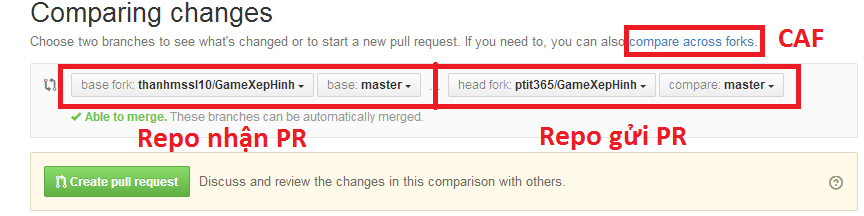

# Dịch-Code-Complete-Edition-2
Dịch Code Complete  Edition 2 - Cuốn sách lập trình viên nào cũng nên đọc

Bạn nào chưa down được sách  thì trong repo đã có sẵn 1 bản ebook .epub, nên dùng add-on hỗ trợ đọc epub của firefox thì sẽ dễ phối hợp với các trình hỗ trợ dịch.
Các bản dịch của từng chương được lưu ở dạng Markdown, bạn nào chưa biết sử dụng MD thì đọc hướng dẫn ở dưới:

**Cách dùng .md file:**
https://help.github.com/articles/github-flavored-markdown/
Hoặc đơn giản bạn viết trực tiếp nội dung trên 2 trang web dưới đây là copy lại vào file .md ở máy khi xong việc
http://jbt.github.io/markdown-editor
https://stackedit.io/
Dùng offline thì có phần mềm Atom khá hay để viết Markdown

***Đăng kí dịch*
Để đăng kí dịch, hoặc thay đổi thông tin của mình thì có thể edit file List_Translators.md trên repo rồi gửi pull request.
Để tránh trường hợp bị trùng phần/chương dịch thì các bạn phải ghi rõ phần/chương mình dịch vào file List_Translators.md, khi có thay đổi (ví dụ như dừng dịch tại phần nào đó, hoặc chuyển phần dịch) thì cũng phải edit file List_Translators.md, rồi ghi rõ vào trong phần ghi chú. Edit xong thì pull request về repo chính. Để chắc chắn các bạn có thể thông báo lên cả topic dịch Code Complete trên DayNhauHoc.com.

**Chú ý:** nếu khi dịch mà gặp câu nào không dịch được, hoặc dịch không ưng ý, hoặc bản gốc có vấn đề gì đó,.. thì có thể comment lại để mọi người sửa giúp ( comment bằng quote `>`) hoặc có thể đăng câu hỏi lên những box hỏi đáp tiếng anh của DayNhauHoc.com để hỏi.

**Hướng dẫn chèn ảnh**

Ảnh thì mình sẽ lược bỏ những cái không cần thiết đi, ví dụ như cái Key Point thì thay bằng chữ luôn, còn những ảnh quan trọng thì phải cho vào 1 thư mục, sau đó dẫn link vào md file là được.
Chèn ảnh cấu trúc là:

    

Trên repo sẽ cho ảnh vào thư mục `Images` nhá, còn tên ảnh thì đặt theo tên ảnh trong tài liệu gốc ví dụ ảnh
> Figure 10-1. "Long live time" means that a variable is live over the course of many statements. "Short live time" means it's live for only a few statements. "Span" refers to how close together the references to a variable are

thì mình để tên là Figure10_1, còn phần thông tin ảnh sẽ là phần chữ còn lại
Còn ảnh nào chưa có tên thì cứ mạnh dạn đặt, nhưng đặt ngắn gọn, dễ hiểu để quản lý cho dễ :blush:

Quy trình chèn ảnh sẽ là, copy ảnh đó ra, rồi đổi tên cho hợp lí rồi cho ảnh vào thư mục Images (trong repo)
sau đó ghi vào vị trí cần chèn là

    

**Hướng dẫn Update dữ liệu từ repo chính**
Để tránh bị báo lỗi  out of date thì nguyên tắc sử dụng GIT đó là các bạn phải thường xuyên PULL các update từ git về trước khi tiến hành sửa, hoặc commit hoặc push.
Đây là cách update dữ liệu từ repo chính mà không cần dùng dòng lệnh hay xóa repo cũ đã fork rồi fork lại nữa. Cách này chỉ cần làm trên giao diện web github.com
Nguyên lý:
Ta sẽ đặt tên repo chính là repo O (original) , repo của bạn là repo U (you), bình thường thì U toàn PR về O, rồi O xác nhận và merge vào repo O, nhưng bây giờ ta làm ngược lại ta sẽ tạo 1 pull request "ngược" từ repo O về repo U , sau đó U sẽ chấp nhận PR đó và merge vào repo U vậy là U đã có toàn bộ data từ O. (và như vậy nghĩa là coi như toàn bộ dữ liệu của bạn sẽ bị thay thế bằng dữ liệu của repo chính nhá, cẩn thận mất dữ liệu đang làm dở)
> *(thực ra nói là tạo 1 PR từ O về U kể ra cũng không hợp lý vì chỉ có chủ của O mới có quyền tạo PR đi bất cứ repo nào, thôi thì gọi là PR "ảo" vậy :blush: )*

Cách làm:
Bạn ấn vào `New pull request`  như bình thường, nó sẽ kiểu như này, có thể hơi khác nhưng không sao, mình cứ "loanh quanh" 3 cái  khoanh đỏ kia kiểu gì cũng sẽ được :blush:

Bạn cứ ấn làm sao cho bên gửi PR là repo O (repo chính) còn bên nhận PR là repo U (repo của bạn)
nếu khi thay đổi mà gặp "biến" thì sẽ dùng nút CAF, xong xuôi thì `Creat pull request` như bình thường, và bạn sẽ nhận được 1 thông báo là vừa nhận được 1 PR từ repo O ->Merge -> done!
