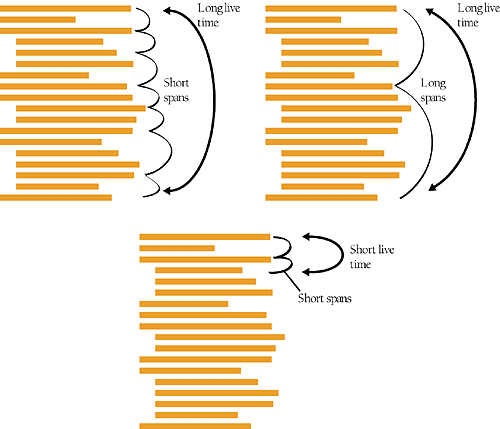

#10.4 Phạm vi biến
"Phạm vi biến" là cách nói về sự tổ chức của biến: nó phổ biến như thế nào ? Phạm vi, hay tầm nhìn đều đề cập đến mức độ mà các biến của bạn được biết cũng như tham chiếu đến trong suốt chương trình. Biến cục bộ chỉ được sử dụng trong một phần của chương trình - ví dụ như vòng lặp hay các vòng lặp nhỏ và những trường hợp đặc biệt. Biến toàn cục có thể sử dụng được nhiều nơi trong chương trình - ví dụ như một bảng thông tin nhân viên được sử dụng xuyên suốt chương trình, hoặc những trường hợp đặc biệt.

Các ngôn ngữ khác nhau xử lí phạm vi biến theo nhiều cách khác nhau. Ở vài ngôn ngữ nguyên thủy, tất cả các biến đều là toàn cục. Bạn không thể kiểm soát các phạm vi của biến và điều đó tạo nên nhiều vấn đề. Ở C++  và các ngôn ngữ tương tự thì một biến có thể được đặt trong một block ( một đoạn code được đóng bởi ngoặc đơn), hoặc hàm, class ( và có thể là các lớp dẫn xuất (derived class) của nó), hoặc cả chương trình. Trong Java và C#, biến có thể được đặt trong package hay namespace ( một tập hợp các class).

Phần tiếp theo sẽ hướng dẫn sử dụng phạm vi biến.

##Cục bộ hóa tham chiếu đến các biến

Những code ở giữa mà tham chiếu điến các biến được gọi là " chiếc cửa sổ hiểm họa". Trong cái cửa sổ đó, code mới có thể được thêm vào, vô tình làm thay đổi các biến, hoặc là ai đó đọc code mà quên mất giá trị của biến được gán. Luôn là một ý tưởng hay khi cục bộ hóa các tham chiếu đến các biến bằng các giữ chúng gần nhau.

Một ý tưởng cục bộ hóa tham chiếu đến một biến là điều rất hiển nhiên, nhưng cái ý tưởng thích hợp với một tính toán mang tính tính hình thức . Có một phương pháp để tính toán mức độ gần nhau của các biến đó là ước tính số bước (số span) của hiến . Đây là ví dụ:


```Ví dụ 10-5. ví dụ về span của trong Java
a=0;
b=0;
c=0;
a= b + c;
```
Trong trường hợp này, có 2 dòng nằm giữa tham chiếu đến biến `a` thứ nhất  và thứ hai , vậy `a` có số span là 2, tương tự ta có số span của b và c lần lượt là 1 và 0. Và đây là một ví dụ khác

```Ví dụ 10-6. ví dụ về 1 span và 0 span trong Java
a = 0;
b = 0;
c = 0;
b = a + 1;
b = b / c;
```

Trong chương hợp này, có 1 dòng giữa tham chiếu đến `b` thứ nhất và thứ hai nên nó có span là 1. Và không có dòng nào giữa tham chiếu thứ hai và tham chiếu thứ ba, vậy có span  là 0.

###Tìm hiểu thêm

Để có thêm thông tin về sắp xếp biến, xem Software Engineering Metrics and Models ( conte, Dunsmore, and Shen 1986).
>phần này không có dẫn link

Khoảng cách trung bình được tính toán dựa trên những span riêng lẻ. Trong ví dụ 2, với b, (1+0)/2 = 0.5, vậy giá trị trung bình số span của b là 0.5. Khi mà bạn giữ các tham chiếu đến biến gần nhau, bạn có thể giúp người đọc code của bạn tập trung vào một phần trong một thời điểm. Nếu bạn gọi biến cách xa nhau, bạn sẽ bắt người đọc lục tung cả chương trình. Vì thế lợi ích chính của việc sắp xếp biến gần nhau là tăng khả năng đọc code rõ ràng và dễ hiểu hơn.

##Giữ cho biến " sống " trong thời gian ít nhất có thể

Khái niệm liên quan đến span của biến còn được gọi là " thời gian tồn tại": tổng số dòng lệnh mà biến được sử dụng. Biến tồn tại từ dòng lệnh đầu tiên mà nó được gọi đến và nó kết thúc ở dòng lệnh cuối cùng mà nó được gọi đến.

Không giống như span, thời gian tồn tại của biến không ảnh hướng bao nhiêu lần biến được sử dụng từ lần đầu tới lần cuối mà biến được gọi đến. Nếu biến được gọi lần đầu tiên ở dòng 1 và lần cuối cùng ở dòng 25 thì nó sẽ tồn tại trong 25 dòng lệnh. Nếu chỉ có 2 dòng trong đó biến được sử dụng thì nó có span trung bình là 23 dòng lệnh. Nếu biến đã được dùng ở mỗi dòng từ dòng 1 đến 25, nó sẽ có số span trung bình là 0 dòng lệnh, nhưng nó vấn sẽ có thời gian sống là 25 dòng lệnh. Hình 10-1 minh họa cả 2 thông số span và thời gian sống.



Như với span, mục tiêu cần quan tâm với thời gian sống đó là giữ con số đó NHỎ, để giữ được biến "chết yểu" nhất có thể.
##Tính toán thời gian tồn tại của biến

Bạn có thể hình thành khái niệm thời gian tồn tại của biến bằng cách đếm số dòng giữa lần đầu và lần cuối gọi biến ( bao gồm cả lần đầu và lần cuối). Đây là ví dụ về thời gian tồn tại biến quá dài

```
Ví dụ 10-7.

1 // khởi chạy mọi biến
2 recordIndex= 0;
3 total = 0;
4 done = false;
	...
26 while ( recordIndex < recordCount ) {
27 ...
28 recordIndex = recordIndex +1;    **<--1**
	...
64 while (!done) {
	...
69 if ( total > projectedTotal ) { 		**<--2**
70 	done=true;			**<--3**
(1) lần cuối gọi recordIndex.
(2) lần cuối gọi total.
(3) lần cuối gọi done.
```

Đây là thời gian tồn tại cho các biến trong ví dụ này:
|----------|------|
| recordIndex | ( line 28 - line 2 + 1 ) = 27 |
| total | ( line 69 - line 3 + 1 ) = 67 |
|done | ( line 70 - line 4 + 1 ) = 67|
|Average Live Time | ( 27 + 67 + 67 ) / 3 ≈ 54|

>làm thế nào chữ trong bảng không bị bôi đen

Ví dụ trên được sửa lên bên dưới để nhận thấy biến có thể được gọi gần nhau hơn

```
Ví dụ 10-8. ví dụ về biến java với thời gian tồn tại ngắn

	...
25	recordIndex =0;		<--1
26


....

```


(1)
(2)

Đây là thời gian tồn tại của biến trong ví dụ:

>**chèn bảng**

Như đã thấy, ví dụ thứ 2 tốt hơn ví dụ thứ nhất bởi khởi tạo biến được biểu diễn gần nhau ở nơi biến được sử dụng.
